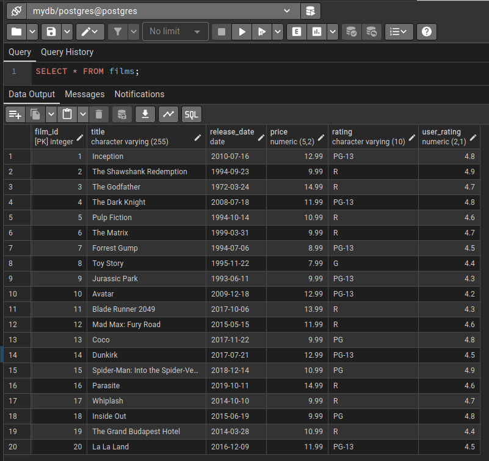
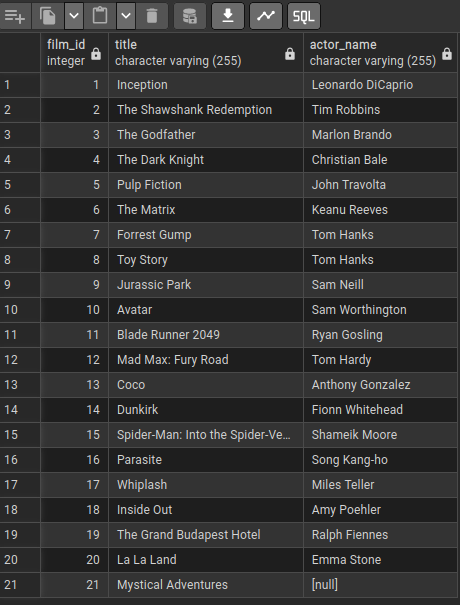
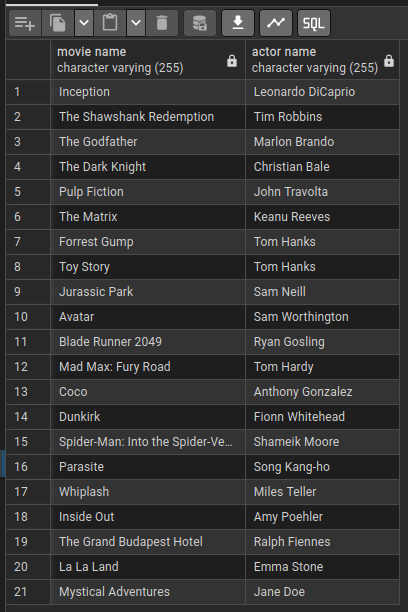

# A06 — SQL Libraries with Postgres & pgAdmin (Containerised)

This project demonstrates a **multi-container Docker Compose setup** with:
- **Postgres** (SQL database)
- **pgAdmin4** (web-based UI for database management)

It is part of my data engineering learning path and portfolio. It shows how to:
- Work with **SQL schemas, tables, joins, and queries**
- Use both **pgAdmin** and the **psql CLI** for database operations
- Configure and persist data with **Docker volumes**
- Perform **backups and restores** of Postgres and pgAdmin volumes

---

## 🚀 Project Structure

```
data-eng-sql-postgres-pgadmin/
├── compose.yaml                  # Docker Compose file (Postgres + pgAdmin)
├── backup.sql                    # SQL dump of database schema & data 
├── pgadmin-data-backup.tar.gz    # Backup archive of pgAdmin persistent volume
└── postgres-data-backup.tar.gz   # Backup archive of Postgres persistent volume
```

---

## 🐳 Running the Containers

Start the environment:

```bash
docker compose up -d
```

Check status:

```bash
docker compose ps
```

Output example:

```bash
[+] Running 30/30
 ✔ postgres Pulled                                                        38.3s
 ✔ pgadmin4 Pulled                                                        42.4s

[+] Running 5/5
 ✔ Network data-eng-sql-postgres-pgadmin_default       Created             0.1s
 ✔ Volume data-eng-sql-postgres-pgadmin_postgres-data  Created             0.0s
 ✔ Volume data-eng-sql-postgres-pgadmin_pgadmin-data   Created             0.0s
 ✔ Container postgres                                  Healthy            11.8s
 ✔ Container pgadmin4                                  Started            11.4s

```


### 🔑 Access the services

- **pgAdmin**: open [http://127.0.0.1:5050](http://127.0.0.1:5050) in your browser.  

👉 **First-time setup in pgAdmin**:  

1. Click **Add New Server**.  
2. Fill in the following:  
   - General → Name: `postgres`  
   - Connection → Host name/address: `postgres` (this matches the service name in `compose.yaml`)  
   - Port: `5432`  
   - Maintenance database: `postgres`  
   - Username: `postgres`  
   - Password: `postgres`  
3. Click **Save** → you should now see your Postgres server listed in the sidebar.  


- **psql CLI** (direct access via terminal):  

```bash
# Open a psql session inside the running postgres container
docker compose exec postgres psql -U postgres
```
---

## 🗂️ Detailed SQL-Tutorial Workflow

We use the psql CLI inside the Postgres container to practice SQL.  
Below is a step-by-step workflow with code, comments, and screenshots from pgAdmin for visualisation.

```sql
-- Create a new database called, e.g., 'mydb'
CREATE DATABASE mydb;
\c mydb
```


✅ Output: We are now connected to database "mydb" as user "postgres".

```sql
-- Create a table
CREATE TABLE users (
    id SERIAL PRIMARY KEY,
    first_name VARCHAR(50),
    last_name VARCHAR(50),
    email VARCHAR(100),
    date_of_birth DATE
);
```
🔎 Check available tables using CLI or pgAdmin 

```sql
\dt
```


```sql
-- Insert rows
mydb=# INSERT INTO users (first_name, last_name, email, date_of_birth) VALUES
('John', 'Doe', 'john.doe@example.com', '1990-01-01'),
('Jane', 'Smith', 'jane.smith@example.com', '1992-05-15'),
('Alice', 'Johnson', 'alice.johnson@example.com', '1985-10-20'),
('Bob', 'Williams', 'bob.williams@example.com', '1998-07-30'),
('Emily', 'Clark', 'emily.clark@example.com', '1987-02-14'),
('Michael', 'Robinson', 'michael.robinson@example.com', '1995-06-05'),
('Sarah', 'Lewis', 'sarah.lewis@example.com', '1989-03-25'),
('David', 'Walker', 'david.walker@example.com', '1992-11-12'),
('Sophia', 'Hall', 'sophia.hall@example.com', '1996-08-08'),
('James', 'Allen', 'james.allen@example.com', '1984-04-20'),
('Olivia', 'Young', 'olivia.young@example.com', '1993-12-30'),
('Chris', 'King', 'chris.king@example.com', '1990-09-15'),
('Grace', 'Wright', 'grace.wright@example.com', '1997-05-10'),
('William', 'Scott', 'william.scott@example.com', '1986-07-22');

-- Query data
SELECT * FROM users;
```
📊 Example query output:


Let's proceed with updating data and 🔎 querying data

```sql
-- Get all unique email addresses
SELECT DISTINCT email FROM users;
```


```sql
-- Select all users with first_name = 'John'
SELECT * FROM users WHERE first_name = 'John';
```


```sql
-- Update John's email address
UPDATE users SET email = 'new_email@gmail.com' WHERE first_name = 'John';
```


After updating a row, notice that John's record is now shown at the bottom of the table output in pgAdmin. This happens because the default `SELECT * FROM users;` does not guarantee any ordering and the rows are returned in the order the database engine chooses. Since John's row was modified, it was effectively moved to the end of the result set in this view.

```sql
-- Order users by ID
SELECT * FROM users ORDER BY id;
```
By explicitly using `ORDER BY`, the rows are sorted consistently by the id column, ensuring stable and predictable results, regardless of update operations.


Next, we create a new table `films` and further practice SQL queries.

```sql
mydb=# CREATE TABLE films (
    film_id SERIAL PRIMARY KEY,
    title VARCHAR(255) NOT NULL,
    release_date DATE,
    price DECIMAL(5,2),
    rating VARCHAR(10),
    user_rating DECIMAL(2,1) CHECK (user_rating >= 1 AND user_rating <= 5)
);
```


Lets verify the List of tables in database `mydb`.
```sql
\dt
```
```bash
         List of relations
 Schema | Name  | Type  |  Owner   
--------+-------+-------+----------
 public | films | table | postgres
 public | users | table | postgres
(2 rows)
```
🎥 Insert film records

```sql
mydb=# INSERT INTO films (title, release_date, price, rating, user_rating) VALUES
('Inception', '2010-07-16', 12.99, 'PG-13', 4.8),
('The Shawshank Redemption', '1994-09-23', 9.99, 'R', 4.9),
('The Godfather', '1972-03-24', 14.99, 'R', 4.7),
('The Dark Knight', '2008-07-18', 11.99, 'PG-13', 4.8),
('Pulp Fiction', '1994-10-14', 10.99, 'R', 4.6),
('The Matrix', '1999-03-31', 9.99, 'R', 4.7),
('Forrest Gump', '1994-07-06', 8.99, 'PG-13', 4.5),
('Toy Story', '1995-11-22', 7.99, 'G', 4.4),
('Jurassic Park', '1993-06-11', 9.99, 'PG-13', 4.3),
('Avatar', '2009-12-18', 12.99, 'PG-13', 4.2),
('Blade Runner 2049', '2017-10-06', 13.99, 'R', 4.3),
('Mad Max: Fury Road', '2015-05-15', 11.99, 'R', 4.6),
('Coco', '2017-11-22', 9.99, 'PG', 4.8),
('Dunkirk', '2017-07-21', 12.99, 'PG-13', 4.5),
('Spider-Man: Into the Spider-Verse', '2018-12-14', 10.99, 'PG', 4.9),
('Parasite', '2019-10-11', 14.99, 'R', 4.6),
('Whiplash', '2014-10-10', 9.99, 'R', 4.7),
('Inside Out', '2015-06-19', 9.99, 'PG', 4.8),
('The Grand Budapest Hotel', '2014-03-28', 10.99, 'R', 4.4),
('La La Land', '2016-12-09', 11.99, 'PG-13', 4.5);
```


🔎 Query films & Counts
```sql
-- Show first 5 films
SELECT * FROM films LIMIT 5;
```


```sql
-- Count how many films have rating >= 4.5
SELECT COUNT(*) FROM films WHERE user_rating >= 4.5;
```
```bash
 count 
-------
    15
(1 row)
```
```sql
-- Count distinct rating categories
SELECT COUNT(DISTINCT rating) FROM films;
```
```bash
 count 
-------
     4
```
📌 DISTINCT rating → returns unique rating values.
📌 COUNT(DISTINCT rating) → counts how many unique ratings exist.

📊 Aggregations

```sql
-- Total sum of all prices
SELECT SUM(price) FROM films;
```
```bash
  sum   
--------
 228.80
(1 row)
```

```sql
-- Average user rating
SELECT AVG(user_rating) FROM films;
```
```bash
        avg         
--------------------
 4.6000000000000000
(1 row)
```

```sql
-- Price statistics
SELECT MAX(price), MIN(price), AVG(price) FROM films;
```
```bash
  max  | min  |         avg         
-------+------+---------------------
 14.99 | 7.99 | 11.4400000000000000
(1 row)
```

📈 Grouped statistics
👉 "What’s the min, max, and average user rating of films in each rating category?"

```sql
SELECT rating, 
  MIN(user_rating), MAX(user_rating), AVG(user_rating) 
FROM films 
GROUP BY rating;
```
📊 Output
```bash
 rating | min | max |        avg         
--------+-----+-----+--------------------
 R      | 4.3 | 4.9 | 4.6111111111111111
 PG-13  | 4.2 | 4.8 | 4.5142857142857143
 PG     | 4.8 | 4.9 | 4.8333333333333333
 G      | 4.4 | 4.4 | 4.4000000000000000
(4 rows)
```


🎭 Extending the Schema: Categories & Actors

Next, we extend our database by creating **related tables** to work with more complex queries and practice joins, subqueries, and unions.

We create a `film_category` table to assign one or more categories (genres) to each film.  
The column `film_id` references the `films(film_id)` column, ensuring referential integrity:

```sql
CREATE TABLE film_category ( 
	category_id SERIAL PRIMARY KEY, 
	film_id INTEGER REFERENCES films(film_id), 
	category_name VARCHAR(50) NOT NULL 
);
```
📌 Constraint:
The value in film_category.film_id must match an existing value in films.film_id.

Now, populate the table with categories for each film:
```sql
INSERT INTO film_category (film_id, category_name) VALUES
(1, 'Sci-Fi'),
(1, 'Thriller'),
(2, 'Drama'),
(3, 'Crime'),
(3, 'Drama'),
(4, 'Action'),
(4, 'Thriller'),
(5, 'Crime'),
(5, 'Drama'),
(6, 'Sci-Fi'),
(6, 'Action'),
(7, 'Drama'),
(7, 'Romance'),
(8, 'Animation'),
(8, 'Family'),
(9, 'Action'),
(9, 'Adventure'),
(10, 'Sci-Fi'),
(10, 'Adventure'),
(11, 'Sci-Fi'),
(11, 'Drama'),
(12, 'Action'),
(12, 'Adventure'),
(13, 'Animation'),
(13, 'Family'),
(14, 'War'),
(14, 'Drama'),
(15, 'Animation'),
(15, 'Action'),
(16, 'Drama'),
(16, 'Thriller'),
(17, 'Drama'),
(17, 'Music'),
(18, 'Animation'),
(18, 'Family'),
(19, 'Comedy'),
(19, 'Drama'),
(20, 'Drama'),
(20, 'Music');
```

Now we add and fill an actors table to store film actors. Each actor has a unique ID and a name:

```sql
CREATE TABLE actors ( 
	actor_id SERIAL PRIMARY KEY, 
	actor_name VARCHAR(255) NOT NULL 
);

--Insert sample actors (associated with films):
INSERT INTO actors (actor_name) VALUES
/* 
Actors from
associated films
*/
('Leonardo DiCaprio'),  -- Associated with Inception
('Tim Robbins'),        -- Associated with The Shawshank Redemption
('Marlon Brando'),      -- Associated with The Godfather
('Christian Bale'),     -- Associated with The Dark Knight
('John Travolta'),      -- Associated with Pulp Fiction
('Keanu Reeves'),       -- Associated with The Matrix
('Tom Hanks'),          -- Associated with Forrest Gump
('Tom Hanks'),          -- Associated with Toy Story (Tom Hanks appears twice for demonstration purposes)
('Sam Neill'),          -- Associated with Jurassic Park
('Sam Worthington'),    -- Associated with Avatar
('Ryan Gosling'),       -- Associated with Blade Runner 2049
('Tom Hardy'),          -- Associated with Mad Max: Fury Road
('Anthony Gonzalez'),   -- Associated with Coco
('Fionn Whitehead'),    -- Associated with Dunkirk
('Shameik Moore'),      -- Associated with Spider-Man: Into the Spider-Verse
('Song Kang-ho'),       -- Associated with Parasite
('Miles Teller'),       -- Associated with Whiplash
('Amy Poehler'),        -- Associated with Inside Out
('Ralph Fiennes'),      -- Associated with The Grand Budapest Hotel
('Emma Stone');         -- Associated with La La Land
```


🔗 Film–Actor Relationships
To connect films with their actors, we use a many-to-many relationship via the film_actors table.

Each row in this table links one `film_id` to one `actor_id`. The combination (`film_id`, `actor_id`) forms the composite primary key.

```sql
CREATE TABLE film_actors (
	film_id INTEGER REFERENCES films(film_id), 
	actor_id INTEGER REFERENCES actors(actor_id), 
	PRIMARY KEY (film_id, actor_id)
);

--Insert associations between films and their actors:
INSERT INTO film_actors (film_id, actor_id) VALUES 
(1, 1), 
(2, 2), 
(3, 3), 
(4, 4), 
(5, 5), 
(6, 6), 
(7, 7), 
(8, 8), 
(9, 9), 
(10, 10), 
(11, 11), 
(12, 12), 
(13, 13), 
(14, 14), 
(15, 15), 
(16, 16), 
(17, 17), 
(18, 18), 
(19, 19), 
(20, 20);
```

🔗 Practicing SQL Joins

📌 At this point, we now have:

- **films** → list of movies  
- **film_category** → each film’s genres  
- **actors** → list of actors  
- **film_actors** → links between films and actors  

This schema allows us to practice **joins, unions, and subqueries** to explore relationships between films, categories, and actors.

🧩 Types of Joins (Quick Overview):
- **INNER JOIN** → returns rows when there is a match in *both* tables.  
- **LEFT JOIN** → returns *all* rows from the left table, plus matching rows from the right table (or NULL if no match).  
- **RIGHT JOIN** → similar with LEFT JOIN but for the second (RIGHT) table given in the query (all from right, matches from left).  
- **FULL OUTER JOIN** → returns all rows when there is a match in *either* table.  

In the sequel we explore and demonstrate the following:
- **INNER JOIN** → restrictive, only shows matched data.  
- **LEFT JOIN** → more inclusive, shows everything from the main table even if there are no matches.  


▶️ Simple `LEFT JOIN`
We start by joining films with their actor references from the `film_actors` table:
```sql
SELECT *
FROM
	films f
LEFT JOIN
	film_actors fa ON f.film_id = fa.film_id
ORDER BY
	f.film_id;
```
📊 Output: Each film is listed along with any matching film–actor links.


▶️ double `LEFT JOIN` with actors
We now extend the join to include actor names by linking with the actors table:
```sql
SELECT *
FROM
	films f
LEFT JOIN
	film_actors fa ON f.film_id = fa.film_id
LEFT JOIN
	actors a ON fa.actor_id = a.actor_id
ORDER BY
	f.film_id;
```
📊 Output: Films + film_actors mapping + actor names.

 

▶️ Selecting Specific Columns

Instead of all columns, we focus on a compact visualization of film titles with their actors:
```sql
SELECT
	f.film_id,
	f.title,
	a.actor_name
FROM
	films f
LEFT JOIN 
	film_actors fa ON f.film_id = fa.film_id
LEFT JOIN
	actors a ON fa.actor_id = a.actor_id
ORDER BY
	f.film_id;
```
📊 Output: Clean view of films with their associated actors.

  

Now let’s add a new film that has no actors assigned:

```sql
INSERT INTO films (title, release_date, price, rating, user_rating) VALUES
('Mystical Adventures', '2023-05-05', 13.99, 'PG', 4.4
);
```


When we run a `LEFT JOIN` query again:
```sql
SELECT 
    f.film_id, 
    f.title, 
    a.actor_name
FROM 
    films f
LEFT JOIN 
    film_actors fa ON f.film_id = fa.film_id
LEFT JOIN 
    actors a ON fa.actor_id = a.actor_id
ORDER BY 
    f.film_id;
```
📊 Output: Mystical Adventures appears with `NULL` in `actor_name`  (since no actors exist yet).



▶️ Comparing `LEFT JOIN` vs `INNER JOIN`
If we switch to an `INNER JOIN`:
```SQL
SELECT 
    f.film_id, 
    f.title, 
    a.actor_name
FROM 
    films f
INNER JOIN 
    film_actors fa ON f.film_id = fa.film_id
INNER JOIN 
    actors a ON fa.actor_id = a.actor_id
ORDER BY 
    f.film_id;
```
📊 Output: Mystical Adventures is excluded, since `INNER JOIN` only shows rows with matches in both tables.

    

🎭 Adding Actors to the New Film

Now let’s assign actors to Mystical Adventures:

```SQL
INSERT INTO films (title, release_date, price, rating, user_rating) VALUES
('Mystical Adventures', '2023-05-05', 13.99, 'PG', 4.4);

INSERT INTO actors (actor_name)
VALUES ('Jane Doe'), ('John Smith');

INSERT INTO film_actors (film_id, actor_id)
VALUES (21, 21), (21, 22);
```
📊 Output: The film now has two actors associated. Both `LEFT JOIN` and `INNER JOIN` will return the same result because matches exist.


🔀 UNION vs UNION ALL

- `UNION` → combines results from multiple queries **and removes duplicates**.  
- `UNION ALL` → combines results and **keeps duplicates**.  

Example: combine all film titles with all actor names into a single column called `name`.

```sql
SELECT title AS name
FROM films
UNION
SELECT actor_name AS name
FROM actors;
```
📊 Output (sample, duplicates omitted):
```
1	The Dark Knight
2	Blade Runner 2049
3	The Matrix
4	Anthony Gonzalez
5	Leonardo DiCaprio
6	Miles Teller
7	Jane Doe
8	John Smith
9	The Shawshank Redemption
10	Toy Story
11	Inception
12	The Grand Budapest Hotel
13	Coco
14	Fionn Whitehead
15	John Travolta
16	Ralph Fiennes
17	Tom Hanks
18	La La Land
19	Mad Max: Fury Road
20	Song Kang-ho
21	Tom Hardy
22	Christian Bale
23	Tim Robbins
24	Sam Neill
25	Whiplash
26	Spider-Man: Into the Spider-Verse
27	Avatar
28	Forrest Gump
29	Pulp Fiction
30	The Godfather
31	Dunkirk
32	Marlon Brando
33	Keanu Reeves
34	Jurassic Park
35	Parasite
36	Emma Stone
37	Inside Out
38	Ryan Gosling
39	Amy Poehler
40	Shameik Moore
41	Mystical Adventures
42	Sam Worthington
```
```sql
SELECT title AS name
FROM films
UNION ALL
SELECT actor_name AS name
FROM actors
ORDER BY name;
```
📊 Output (sample, duplicates shown):

```
1	Amy Poehler
2	Anthony Gonzalez
3	Avatar
4	Blade Runner 2049
5	Christian Bale
6	Coco
7	Dunkirk
8	Emma Stone
9	Fionn Whitehead
10	Forrest Gump
11	Inception
12	Inside Out
13	Jane Doe
14	John Smith
15	John Travolta
16	Jurassic Park
17	Keanu Reeves
18	La La Land
19	Leonardo DiCaprio
20	Mad Max: Fury Road
21	Marlon Brando
22	Miles Teller
23	Mystical Adventures
24	Parasite
25	Pulp Fiction
26	Ralph Fiennes
27	Ryan Gosling
28	Sam Neill
29	Sam Worthington
30	Shameik Moore
31	Song Kang-ho
32	Spider-Man: Into the Spider-Verse
33	The Dark Knight
34	The Godfather
35	The Grand Budapest Hotel
36	The Matrix
37	The Shawshank Redemption
38	Tim Robbins
39	Tom Hanks
40	Tom Hanks
41	Tom Hardy
42	Toy Story
43	Whiplash
```

🔎 Subqueries with `IN`
We can use a subquery to find films that have specific actors.
For example, retrieve all films that feature Leonardo DiCaprio or Tom Hanks:

```sql
SELECT title
FROM films
WHERE film_id IN
(SELECT fa.film_id
 FROM film_actors fa
 JOIN actors a ON a.actor_id = fa.actor_id
 WHERE a.actor_name IN ('Leonardo DiCaprio', 'Tom Hanks'));
```
📊 Output: films where those specific actors appear.


📥 Subqueries in the `SELECT` Clause
Subqueries can also be embedded directly in the SELECT list.

Example 1 — Film with one actor:
Retrieve each film’s title along with the name of one of its actors:

```sql
SELECT title AS "movie name",
       (SELECT actor_name
        FROM actors a
        JOIN film_actors fa ON a.actor_id = fa.actor_id
        WHERE fa.film_id = f.film_id
        LIMIT 1) AS "actor name"
FROM films f;
```
📊 Output: Each film title paired with one actor.


Example 2 — Actor with one film:
Retrieve each actor along with the title of one film they appeared in:

```sql
SELECT actor_name AS "actor name",
       (SELECT title
        FROM films f
        JOIN film_actors fa ON f.film_id = fa.film_id
        WHERE fa.actor_id = a.actor_id
        LIMIT 1) AS "film name"
FROM actors a;
```
📊 Output: Each actor paired with one film.


🏁 Closing the SQL Tutorial Workflow

By the end of this workflow we have built a **mini relational database schema** consisting of:

- **users** → a simple table for practicing inserts, updates, and queries  
- **films** → storing movies with attributes like title, release date, price, and ratings  
- **film_category** → linking films to one or more genres  
- **actors** → storing actors’ names  
- **film_actors** → a many-to-many relationship table connecting films and actors  

With this schema in place, we practiced:

- **DDL (Data Definition Language)** → creating tables, defining primary/foreign keys, and constraints  
- **DML (Data Manipulation Language)** → inserting, updating, and querying data  
- **Filtering & Aggregations** → using `WHERE`, `COUNT`, `SUM`, `AVG`, `MIN`, `MAX`, and `GROUP BY`  
- **Joins** → `INNER JOIN` vs `LEFT JOIN` to understand inclusion/exclusion of unmatched rows  
- **UNION vs UNION ALL** → combining result sets with and without duplicates  
- **Subqueries** → using nested queries in `WHERE` and `SELECT` clauses  

📊 Together, these examples cover **core SQL fundamentals** while leveraging Docker Compose to provide a **reproducible environment** with **persistent storage**.  

This section serves as both a **learning notebook** and a **portfolio artifact**, showing hands-on experience with relational database design, querying, and containerised workflows.


---

## 💾 Backups & Restores

### Dump database to SQL file
```bash
docker compose exec postgres pg_dump -U postgres -d mydb > backup.sql
```

### Restore database from dump
```bash
docker compose exec postgres psql -U postgres -c "CREATE DATABASE mydb;"
docker compose exec -T postgres psql -U postgres -d mydb < backup.sql
```

### Backup persistent volumes
```bash
# Postgres data
docker run --rm \
  -v data-eng-sql-postgres-pgadmin_postgres-data:/volume \
  -v $(pwd):/backup \
  alpine \
  tar -czf /backup/postgres-data-backup.tar.gz -C /volume .

# pgAdmin data
docker run --rm \
  -v data-eng-sql-postgres-pgadmin_pgadmin-data:/volume \
  -v $(pwd):/backup \
  alpine \
  tar -czf /backup/pgadmin-data-backup.tar.gz -C /volume .
```

### Restore persistent volumes
```bash
docker run --rm \
  -v data-eng-sql-postgres-pgadmin_postgres-data:/volume \
  -v $(pwd):/backup \
  alpine \
  sh -c "cd /volume && tar -xzf /backup/postgres-data-backup.tar.gz"

docker run --rm \
  -v data-eng-sql-postgres-pgadmin_pgadmin-data:/volume \
  -v $(pwd):/backup \
  alpine \
  sh -c "cd /volume && tar -xzf /backup/pgadmin-data-backup.tar.gz"
```

---

## 📚 Learning Outcomes

- Learned to orchestrate **multi-container apps** with Docker Compose.
- Worked with **persistent volumes** to preserve database state.
- Practiced **SQL (DDL, DML, queries, joins, subqueries, unions)**.
- Used both **CLI (psql)** and **GUI (pgAdmin)** for DB management.
- Automated **backup & restore** processes for both Postgres and pgAdmin.

---

📌 This mini-project demonstrates practical **data engineering fundamentals**: containerisation, database persistence, SQL practice, and backup strategies.
